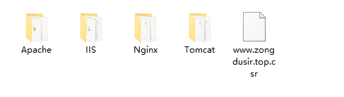

#### 从腾讯云中免费下载ssl证书，一年的有效期


解压后就会有以下文件，腾讯云对其有四种方案的说明，我用的是iis方案，过程顺利，但是却没有效果，可能是因为还缺少其它步骤


以下是关键代码
```js
var fs = require('fs');
var https = require('https');
var options = {
	pfx: fs.readFileSync('./证书.pfx'),
	passphrase: 'iis文件夹keystorePass.text内容'
}
var httpServer = https.createServer(options,app)
httpServer.listen(443, function(){
	console.log('https')
})
```

因为http监听的是80端口，但是https监听的是443端口,所以要写两个
完整代码:
```js
// 加载express模块
var express = require('express');
var swig = require('swig');
var app = express();
var bp = require('body-parser');
var cookies = require('cookies');
var path = require('path')
// 后台上传的模块
var multipart = require('connect-multiparty');
var multipartMiddleware = multipart();
app.use(multipart({uploadDir:'./proImg' }));

app.use('/',require('./routers/getUser'))
app.get('/',function(req,res){
	res.send('正常访问，ojbk')
})

//图片访问
app.get('/proImg/*', function (req, res) {
    res.sendFile( __dirname + req.url);
})

// ssl证明
app.get('/.well-known/pki-validation/fileauth.txt', function (req, res) {
	console.log(1)
    res.sendFile(__dirname+'/.well-known/pki-validation/fileauth.txt');
})
// 开启端口
server = app.listen(80)

// 开启https 关键
var fs = require('fs');
var https = require('https');
var options = {
	pfx: fs.readFileSync('./www.zongdusir.top.pfx'),
	passphrase: '1f90815m04097m'
}
var httpServer = https.createServer(options,app)
httpServer.listen(443, function(){
	console.log('https')
})
```