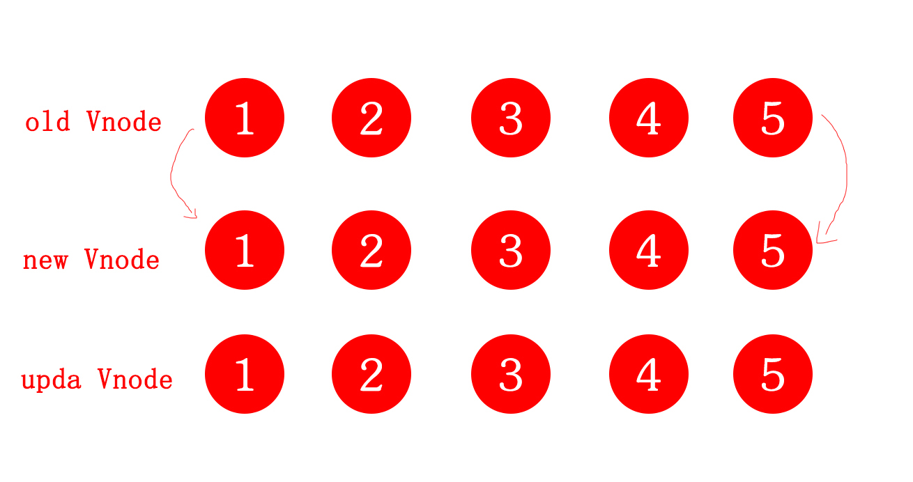
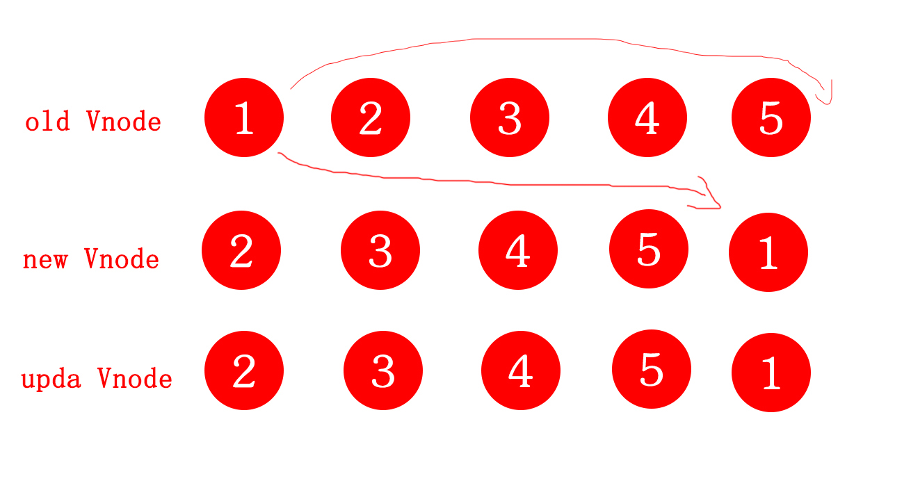
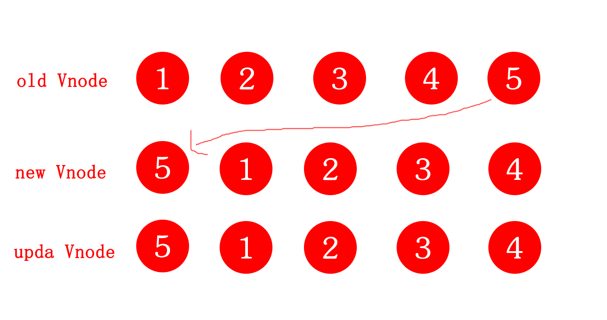
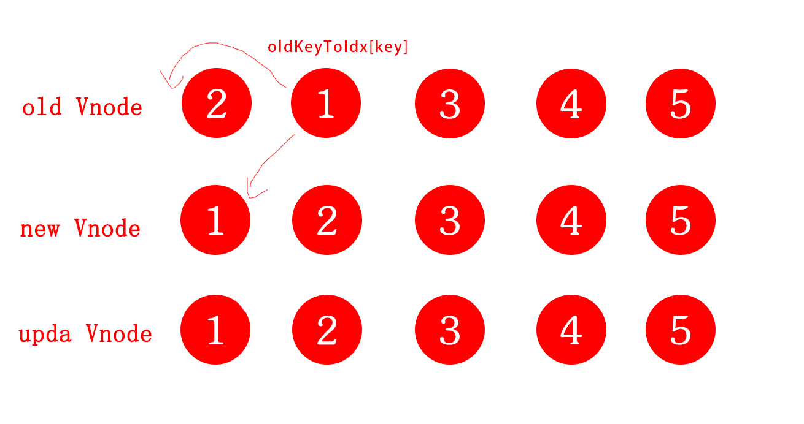
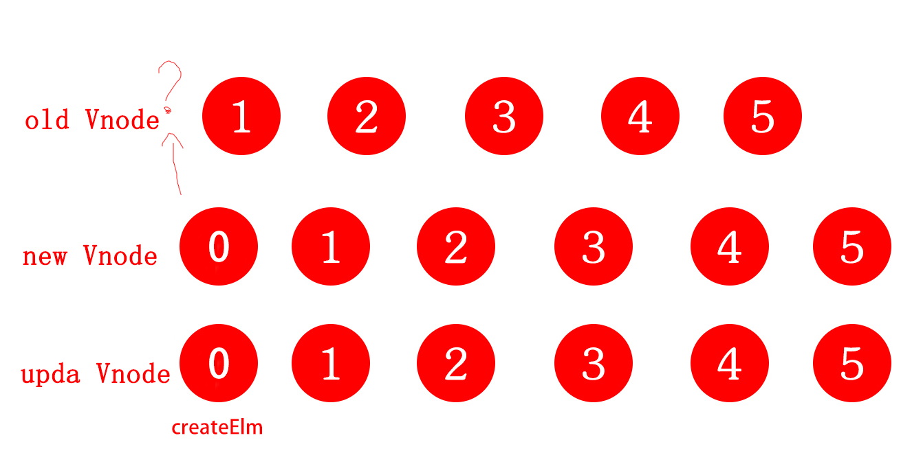
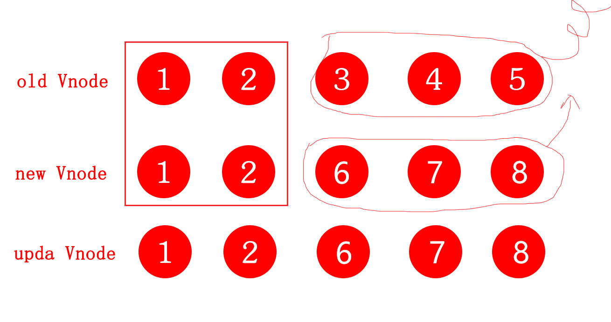

### patch  

### diff 记录新旧dom节点差异

这一步部分主要是数据更新的核心代码（diff算法），渲染真实dom节点到页面上

然后开始将旧子节点组和新子节点组进行逐一比对，直到遍历完任一子节点组，比对策略有5种：
* oldStartVnode和newStartVnode进行比对，如果相似，则进行patch，然后新旧头索引都后移
* oldEndVnode和newEndVnode进行比对，如果相似，则进行patch，然后新旧尾索引前移
* oldStartVnode和newEndVnode进行比对，如果相似，则进行patch，将旧节点移位到最后
* oldEndVnode和newStartVnode进行比对，处理和上面类似，只不过改为左移
* 如果以上情况都失败了，我们就只能复用key相同的节点了。首先要通过createKeyToOldIdx
* 遍历完之后，将剩余的新Vnode添加到最后一个新节点的位置后或者删除多余的旧节点


#### 1. 新头和旧头比较，或新尾和旧尾比较，如果相同，直接用patchVnode函数更新



#### 2. 旧头和新尾节点比较，如果相同，说明原来的旧头的节点被移动到新尾的后面，则用patchVnode函数更新


#### 3. 反之，旧尾和新头比较，如果相同，说明原来的旧尾的节点被移动到新头的前面，则用patchVnode函数更新



### 4. 以上情况不符合，则通过createKeyToOldIdx获取oldKeyToIdx,里面存放了一个key为旧节点的Vnode，value为对象index徐磊的哈希表，让从这个哈希表中判断是否有与newStartVnode（或newEndVnode）一致的key的旧节点的Vnode，如果相同，会调用patchVnode函数更新，并且会将真实的dom移动到对应的位置


### 5. 如果newStartVnode在旧的Vnode找不到一致的key，或者不符合sameVnode，说明这个元素是新增的，就会调用createElm创建新的dom节点



### 6.


```js
  /**
   *
  * @param parentElm 父节点
  * @param oldCh 旧节点数组
  * @param newCh 新节点数组
  * @param insertedVnodeQueue
  */
function updateChildren(parentElm, oldCh, newCh, insertedVnodeQueue) {
  var oldStartIdx = 0, newStartIdx = 0;
  var oldEndIdx = oldCh.length - 1;
  var oldStartVnode = oldCh[0];
  var oldEndVnode = oldCh[oldEndIdx];
  var newEndIdx = newCh.l ength - 1;
  var newStartVnode = newCh[0];
  var newEndVnode = newCh[newEndIdx];
  var oldKeyToIdx, idxInOld, elmToMove, before;

  // 当老节点开始索引 小于等于 老节点的结尾索引
  // 并且新节点开始索引 小于等于 新节点的结尾索引
  // 的时候结束整个循环
  while (oldStartIdx <= oldEndIdx && newStartIdx <= newEndIdx) {
    // 假如没有oldStartVnode，就将oldStartVnode+1
    if (isUndef(oldStartVnode)) {
      oldStartVnode = oldCh[++oldStartIdx]; // Vnode has been moved left
    // 假如没有oldEndIdx，就将oldEndIdx-1
    } else if (isUndef(oldEndVnode)) {
      oldEndVnode = oldCh[--oldEndIdx];
    }
    // 当Vnode的tag，key，isComment,data相同,如果是input标签，则判断type类型
    //如果旧头索引节点和新头索引节点相同，调用patchVnode比较两个节点
    else if (sameVnode(oldStartVnode, newStartVnode)) {
      //对旧头索引节点和新头索引节点进行diff更新， 从而达到复用节点效果
      patchVnode(oldStartVnode, newStartVnode, insertedVnodeQueue);
      //旧头索引向后
      oldStartVnode = oldCh[++oldStartIdx];
      //新头索引向后
      newStartVnode = newCh[++newStartIdx];
    }
    //如果旧尾索引节点和新尾索引节点相似，可以复用
    else if (sameVnode(oldEndVnode, newEndVnode)) {
      //旧尾索引节点和新尾索引节点进行更新
      patchVnode(oldEndVnode, newEndVnode, insertedVnodeQueue);
      //旧尾索引向前
      oldEndVnode = oldCh[--oldEndIdx];
      //新尾索引向前
      newEndVnode = newCh[--newEndIdx];
    }
      //  如果旧头索引节点和新头索引节点相似，可以通过移动来复用
    else if (sameVnode(oldStartVnode, newEndVnode)) { // Vnode moved right
      patchVnode(oldStartVnode, newEndVnode, insertedVnodeQueue);
      api.insertBefore(parentElm, oldStartVnode.elm, api.nextSibling(oldEndVnode.elm));
      oldStartVnode = oldCh[++oldStartIdx];
      newEndVnode = newCh[--newEndIdx];
    }
    //原理与上面相同
    else if (sameVnode(oldEndVnode, newStartVnode)) { // Vnode moved left
      patchVnode(oldEndVnode, newStartVnode, insertedVnodeQueue);
      api.insertBefore(parentElm, oldEndVnode.elm, oldStartVnode.elm);
      oldEndVnode = oldCh[--oldEndIdx];
      newStartVnode = newCh[++newStartIdx];
    }
    // 如果上面的判断都不通过，就需要比较新旧的key来判断
    else {
      //如果不存在旧节点的key-index表，则创建
      if (isUndef(oldKeyToIdx)) oldKeyToIdx = createKeyToOldIdx(oldCh, oldStartIdx, oldEndIdx);
      //找到新节点在旧节点组中对应节点的位置
      idxInOld = oldKeyToIdx[newStartVnode.key];
      //如果新节点在旧节点中不存在，将它插入到旧头索引节点前，然后新头索引向后
      if (isUndef(idxInOld)) { // New element
        // newStartVnode没有key或者是该key没有在老节点中找到则创建一个新的节点
        api.insertBefore(parentElm, createElm(newStartVnode, insertedVnodeQueue), oldStartVnode.elm);
        newStartVnode = newCh[++newStartIdx];
      } else {
        //如果新节点在就旧节点组中存在，获取同索引 旧节点的key
        elmToMove = oldCh[idxInOld];
        //先将新节点和对应旧节点作更新
        patchVnode(elmToMove, newStartVnode, insertedVnodeQueue);
        //然后将旧节点组中对应节点设置为undefined,代表已经遍历过了，不在遍历，否则可能存在重复插入的问题
        oldCh[idxInOld] = undefined;
        //插入到旧头索引节点之前
        api.insertBefore(parentElm, elmToMove.elm, oldStartVnode.elm);
        //新头索引向后
        newStartVnode = newCh[++newStartIdx];
      }
    }
  }
  //当旧头索引大于旧尾索引时，代表旧节点组已经遍历完，将剩余的新Vnode添加到最后一个新节点的位置后
  if (oldStartIdx > oldEndIdx) {
    before = isUndef(newCh[newEndIdx+1]) ? null : newCh[newEndIdx+1].elm;
    addVnodes(parentElm, before, newCh, newStartIdx, newEndIdx, insertedVnodeQueue);
  }
  //如果新节点组先遍历完，那么代表旧节点组中剩余节点都不需要，所以直接删除
  else if (newStartIdx > newEndIdx) {
    removeVnodes(parentElm, oldCh, oldStartIdx, oldEndIdx);
  }
}
```


```js
import VNode, { cloneVNode } from './vnode'
import config from '../config'
import { SSR_ATTR } from 'shared/constants'
import { registerRef } from './modules/ref'
import { traverse } from '../observer/traverse'
import { activeInstance } from '../instance/lifecycle'
import { isTextInputType } from 'web/util/element'

import {
  warn,
  isDef,
  isUndef,
  isTrue,
  makeMap,
  isRegExp,
  isPrimitive
} from '../util/index'

export const emptyNode = new VNode('', {}, [])

const hooks = ['create', 'activate', 'update', 'remove', 'destroy']
/*
  key相同
  tag相同
  isComment (注释节点)相同
  data 是否是当前节点数据对象,是一个vnodData对象
  满足相同节点的条件
  sameInputType 同时对input的type按断
*/
function sameVnode (a, b) {
  return (
    a.key === b.key && (
      (
        a.tag === b.tag &&
        a.isComment === b.isComment &&
        isDef(a.data) === isDef(b.data) &&
        sameInputType(a, b)
      ) || (
        isTrue(a.isAsyncPlaceholder) &&
        a.asyncFactory === b.asyncFactory &&
        isUndef(b.asyncFactory.error)
      )
    )
  )
}

// 判断当前input 的type是否相同
// 某些浏览器不支持动态修改input类型
function sameInputType (a, b) {
  if (a.tag !== 'input') return true
  let i
  const typeA = isDef(i = a.data) && isDef(i = i.attrs) && i.type
  const typeB = isDef(i = b.data) && isDef(i = i.attrs) && i.type
  return typeA === typeB || isTextInputType(typeA) && isTextInputType(typeB)
}

// 将oldVnode数组中位置对oldVnode.key的映射转换为oldVnode.key映射
function createKeyToOldIdx (children, beginIdx, endIdx) {
  let i, key
  const map = {}
  for (i = beginIdx; i <= endIdx; ++i) {
    key = children[i].key
    if (isDef(key)) map[key] = i
  }
  return map
}

export function createPatchFunction (backend) {
  let i, j
  const cbs = {}
  const { modules, nodeOps } = backend
    for (i = 0; i < hooks.length; ++i) {
    cbs[hooks[i]] = []
    for (j = 0; j < modules.length; ++j) {
      if (isDef(modules[j][hooks[i]])) {
        cbs[hooks[i]].push(modules[j][hooks[i]])
      }
    }
  }
  // 对真实的dom节点，转换为Vnode
  // <div id='a' class='b c'></div>
  // {sel:'div#a.b.c',data:{},children:[],text:undefined,elm:<div id='a' class='b c'>}
  function emptyNodeAt (elm) {
    return new VNode(nodeOps.tagName(elm).toLowerCase(), {}, [], undefined, elm)
  }
  // remove钩子后的回调，实际上是对remove计数的操作，当全部remove后才会从父节点中执行删除
  function createRmCb (childElm, listeners) {
    function remove () {
      if (--remove.listeners === 0) {
        removeNode(childElm)
      }
    }
    remove.listeners = listeners
    return remove
  }
  // 删除dom
  function removeNode (el) {
    const parent = nodeOps.parentNode(el)
    // element may have already been removed due to v-html / v-text
    if (isDef(parent)) {
      nodeOps.removeChild(parent, el)
    }
  }

  function isUnknownElement (vnode, inVPre) {
    return (
      !inVPre &&
      !vnode.ns &&
      !(
        config.ignoredElements.length &&
        config.ignoredElements.some(ignore => {
          return isRegExp(ignore)
            ? ignore.test(vnode.tag)
            : ignore === vnode.tag
        })
      ) &&
      config.isUnknownElement(vnode.tag)
    )
  }

  let creatingElmInVPre = 0


  // 根据传入的Vnode数据结构，创建真实的dom节点并赋给vnode.elm保存
  //如果有children则会遍历这些子节点，递归调用createElm
  // 每创建完一个真实dom节点，就会往队列中创建vnode
  //当vnode对象全部创建完之后，就调用依次调用这个队列的insertg钩子
  function createElm (
    vnode,
    insertedVnodeQueue,
    parentElm,
    refElm,
    nested,
    ownerArray,
    index
  ) {
    if (isDef(vnode.elm) && isDef(ownerArray)) {
      // This vnode was used in a previous render!
      // now it's used as a new node, overwriting its elm would cause
      // potential patch errors down the road when it's used as an insertion
      // reference node. Instead, we clone the node on-demand before creating
      // associated DOM element for it.
      vnode = ownerArray[index] = cloneVNode(vnode)
    }

    vnode.isRootInsert = !nested // for transition enter check
    if (createComponent(vnode, insertedVnodeQueue, parentElm, refElm)) {
      return
    }

    const data = vnode.data
    const children = vnode.children
    const tag = vnode.tag
    if (isDef(tag)) {
      if (process.env.NODE_ENV !== 'production') {
        if (data && data.pre) {
          creatingElmInVPre++
        }
        if (isUnknownElement(vnode, creatingElmInVPre)) {
          warn(
            'Unknown custom element: <' + tag + '> - did you ' +
            'register the component correctly? For recursive components, ' +
            'make sure to provide the "name" option.',
            vnode.context
          )
        }
      }

      vnode.elm = vnode.ns
        ? nodeOps.createElementNS(vnode.ns, tag)
        : nodeOps.createElement(tag, vnode)
      setScope(vnode)

      /* istanbul ignore if */
      if (__WEEX__) {
        // in Weex, the default insertion order is parent-first.
        // List items can be optimized to use children-first insertion
        // with append="tree".
        const appendAsTree = isDef(data) && isTrue(data.appendAsTree)
        if (!appendAsTree) {
          if (isDef(data)) {
            invokeCreateHooks(vnode, insertedVnodeQueue)
          }
          insert(parentElm, vnode.elm, refElm)
        }
        createChildren(vnode, children, insertedVnodeQueue)
        if (appendAsTree) {
          if (isDef(data)) {
            invokeCreateHooks(vnode, insertedVnodeQueue)
          }
          insert(parentElm, vnode.elm, refElm)
        }
      } else {
        createChildren(vnode, children, insertedVnodeQueue)
        if (isDef(data)) {
          invokeCreateHooks(vnode, insertedVnodeQueue)
        }
        insert(parentElm, vnode.elm, refElm)
      }

      if (process.env.NODE_ENV !== 'production' && data && data.pre) {
        creatingElmInVPre--
      }
    } else if (isTrue(vnode.isComment)) {
      vnode.elm = nodeOps.createComment(vnode.text)
      insert(parentElm, vnode.elm, refElm)
    } else {
      vnode.elm = nodeOps.createTextNode(vnode.text)
      insert(parentElm, vnode.elm, refElm)
    }
  }

  function createComponent (vnode, insertedVnodeQueue, parentElm, refElm) {
    let i = vnode.data
    if (isDef(i)) {
      const isReactivated = isDef(vnode.componentInstance) && i.keepAlive
      if (isDef(i = i.hook) && isDef(i = i.init)) {
        i(vnode, false /* hydrating */)
      }
      // after calling the init hook, if the vnode is a child component
      // it should've created a child instance and mounted it. the child
      // component also has set the placeholder vnode's elm.
      // in that case we can just return the element and be done.
      if (isDef(vnode.componentInstance)) {
        initComponent(vnode, insertedVnodeQueue)
        insert(parentElm, vnode.elm, refElm)
        if (isTrue(isReactivated)) {
          reactivateComponent(vnode, insertedVnodeQueue, parentElm, refElm)
        }
        return true
      }
    }
  }

  function initComponent (vnode, insertedVnodeQueue) {
    if (isDef(vnode.data.pendingInsert)) {
      insertedVnodeQueue.push.apply(insertedVnodeQueue, vnode.data.pendingInsert)
      vnode.data.pendingInsert = null
    }
    vnode.elm = vnode.componentInstance.$el
    if (isPatchable(vnode)) {
      invokeCreateHooks(vnode, insertedVnodeQueue)
      setScope(vnode)
    } else {
      // empty component root.
      // skip all element-related modules except for ref (#3455)
      registerRef(vnode)
      // make sure to invoke the insert hook
      insertedVnodeQueue.push(vnode)
    }
  }

  function reactivateComponent (vnode, insertedVnodeQueue, parentElm, refElm) {
    let i
    // hack for #4339: a reactivated component with inner transition
    // does not trigger because the inner node's created hooks are not called
    // again. It's not ideal to involve module-specific logic in here but
    // there doesn't seem to be a better way to do it.
    let innerNode = vnode
    while (innerNode.componentInstance) {
      innerNode = innerNode.componentInstance._vnode
      if (isDef(i = innerNode.data) && isDef(i = i.transition)) {
        for (i = 0; i < cbs.activate.length; ++i) {
          cbs.activate[i](emptyNode, innerNode)
        }
        insertedVnodeQueue.push(innerNode)
        break
      }
    }
    // unlike a newly created component,
    // a reactivated keep-alive component doesn't insert itself
    insert(parentElm, vnode.elm, refElm)
  }

  function insert (parent, elm, ref) {
    if (isDef(parent)) {
      if (isDef(ref)) {
        if (ref.parentNode === parent) {
          nodeOps.insertBefore(parent, elm, ref)
        }
      } else {
        nodeOps.appendChild(parent, elm)
      }
    }
  }

  // 判断vnode的children是不是一个数组，如果是，就递归执行createChildren函数
  // 如果是test就调用createTextNode创建文本内容
  function createChildren (vnode, children, insertedVnodeQueue) {
    if (Array.isArray(children)) {
      if (process.env.NODE_ENV !== 'production') {
        checkDuplicateKeys(children)
      }
      for (let i = 0; i < children.length; ++i) {
        // 递归
        createElm(children[i], insertedVnodeQueue, vnode.elm, null, true, children, i)
      }
    } else if (isPrimitive(vnode.text)) {
      // 创建文本内容
      nodeOps.appendChild(vnode.elm, nodeOps.createTextNode(String(vnode.text)))
    }
  }

  function isPatchable (vnode) {
    while (vnode.componentInstance) {
      vnode = vnode.componentInstance._vnode
    }
    return isDef(vnode.tag)
  }

  function invokeCreateHooks (vnode, insertedVnodeQueue) {
    for (let i = 0; i < cbs.create.length; ++i) {
      cbs.create[i](emptyNode, vnode)
    }
    i = vnode.data.hook // Reuse variable
    if (isDef(i)) {
      if (isDef(i.create)) i.create(emptyNode, vnode)
      if (isDef(i.insert)) insertedVnodeQueue.push(vnode)
    }
  }

  // set scope id attribute for scoped CSS.
  // this is implemented as a special case to avoid the overhead
  // of going through the normal attribute patching process.
  function setScope (vnode) {
    let i
    if (isDef(i = vnode.fnScopeId)) {
      nodeOps.setStyleScope(vnode.elm, i)
    } else {
      let ancestor = vnode
      while (ancestor) {
        if (isDef(i = ancestor.context) && isDef(i = i.$options._scopeId)) {
          nodeOps.setStyleScope(vnode.elm, i)
        }
        ancestor = ancestor.parent
      }
    }
    // for slot content they should also get the scopeId from the host instance.
    if (isDef(i = activeInstance) &&
      i !== vnode.context &&
      i !== vnode.fnContext &&
      isDef(i = i.$options._scopeId)
    ) {
      nodeOps.setStyleScope(vnode.elm, i)
    }
  }

  // 将vnode转换用真实dom，然后插入dom树指定的位置
  function addVnodes (parentElm, refElm, vnodes, startIdx, endIdx, insertedVnodeQueue) {
    for (; startIdx <= endIdx; ++startIdx) {
      createElm(vnodes[startIdx], insertedVnodeQueue, parentElm, refElm, false, vnodes, startIdx)
    }
  }

  // 触发destory的回调
  // destroy函数主要是清除节点与其他实例的关系，解绑所有的指令和时间监听器,但是destroy不会删除节点
  function invokeDestroyHook (vnode) {
    let i, j
    const data = vnode.data
    if (isDef(data)) {
      // 先触发当前节点的destory回调
      if (isDef(i = data.hook) && isDef(i = i.destroy)) i(vnode)
      // 在触发全局下的destory回调
      for (i = 0; i < cbs.destroy.length; ++i) cbs.destroy[i](vnode)
    }
    if (isDef(i = vnode.children)) {
      for (j = 0; j < vnode.children.length; ++j) {
        // 最后递归触发子节点的回调
        invokeDestroyHook(vnode.children[j])
      }
    }
  }

  // 配合invokeDestoryHook和createRmCbs使用，批量删除dom节点
  function removeVnodes (parentElm, vnodes, startIdx, endIdx) {
    for (; startIdx <= endIdx; ++startIdx) {
      const ch = vnodes[startIdx]
      if (isDef(ch)) {
        if (isDef(ch.tag)) {
          removeAndInvokeRemoveHook(ch)
          invokeDestroyHook(ch)
        } else { // Text node
          removeNode(ch.elm)
        }
      }
    }
  }
  // 调用删除 钩子函数
  function removeAndInvokeRemoveHook (vnode, rm) {
    if (isDef(rm) || isDef(vnode.data)) {
      let i
      const listeners = cbs.remove.length + 1
      if (isDef(rm)) {
        // we have a recursively passed down rm callback
        // increase the listeners count
        rm.listeners += listeners
      } else {
        // directly removing
        rm = createRmCb(vnode.elm, listeners)
      }
      // recursively invoke hooks on child component root node
      if (isDef(i = vnode.componentInstance) && isDef(i = i._vnode) && isDef(i.data)) {
        removeAndInvokeRemoveHook(i, rm)
      }
      for (i = 0; i < cbs.remove.length; ++i) {
        cbs.remove[i](vnode, rm)
      }
      if (isDef(i = vnode.data.hook) && isDef(i = i.remove)) {
        i(vnode, rm)
      } else {
        rm()
      }
    } else {
      removeNode(vnode.elm)
    }
  }

  function checkDuplicateKeys (children) {
    const seenKeys = {}
    for (let i = 0; i < children.length; i++) {
      const vnode = children[i]
      const key = vnode.key
      if (isDef(key)) {
        if (seenKeys[key]) {
          warn(
            `Duplicate keys detected: '${key}'. This may cause an update error.`,
            vnode.context
          )
        } else {
          seenKeys[key] = true
        }
      }
    }
  }
  // 获取节点索引
  function findIdxInOld (node, oldCh, start, end) {
    for (let i = start; i < end; i++) {
      const c = oldCh[i]
      if (isDef(c) && sameVnode(node, c)) return i
    }
  }

  /*
    1. 如果新旧Vnode是静态，并且key值一样（相同节点），并且Vnode是克隆的或是使用了v-once（值渲染一次）
    那么只替换elm和componentInstance

    2. 如果新旧节点都有子节点，则对子节点进行diff差异比较操作，调用updateChildren，

    3. 如果旧节点没有子节点，但是新节点有子节点，先清空新节点的文本内容，然后添加新节点的子节点

    4. 新节点没有子节点，但是旧节点有子节点，则删除旧节点的子节点

    5. 新旧节点都没有子节点，那么只是文本的替换
  */
  function patchVnode (oldVnode, vnode, insertedVnodeQueue, removeOnly) {
    // 两个节点相同，表示无变化
    if (oldVnode === vnode) {
      return
    }
    const elm = vnode.elm = oldVnode.elm
    /*
      如果新旧vnode都是静态的，同时他们的key相同（表示同一节点）
      如果vnode是克隆的或者是标记了once（v-once只渲染一次）
      最后只替换elm和componentInstance即可
    */
    if (isTrue(oldVnode.isAsyncPlaceholder)) {
      if (isDef(vnode.asyncFactory.resolved)) {
        hydrate(oldVnode.elm, vnode, insertedVnodeQueue)
      } else {
        vnode.isAsyncPlaceholder = true
      }
      return
    }

    // reuse element for static trees.
    // note we only do this if the vnode is cloned -
    // if the new node is not cloned it means the render functions have been
    // reset by the hot-reload-api and we need to do a proper re-render.
    if (isTrue(vnode.isStatic) &&
      isTrue(oldVnode.isStatic) &&
      vnode.key === oldVnode.key &&
      (isTrue(vnode.isCloned) || isTrue(vnode.isOnce))
    ) {
      vnode.componentInstance = oldVnode.componentInstance
      return
    }

    let i
    const data = vnode.data
    if (isDef(data) && isDef(i = data.hook) && isDef(i = i.prepatch)) {
      i(oldVnode, vnode)
    }

    const oldCh = oldVnode.children
    const ch = vnode.children
    if (isDef(data) && isPatchable(vnode)) {
      // 调用upda回调和钩子
      for (i = 0; i < cbs.update.length; ++i) cbs.update[i](oldVnode, vnode)
      if (isDef(i = data.hook) && isDef(i = i.update)) i(oldVnode, vnode)
    }
    // 这个节点如果没有文本内容
    if (isUndef(vnode.text)) {
      if (isDef(oldCh) && isDef(ch)) {
        // 如果新节点和旧节点都有 子节点，并且子节点不相同
        // 那么对子节点 diff对比更新，调用updateChildren函数
        if (oldCh !== ch) updateChildren(elm, oldCh, ch, insertedVnodeQueue, removeOnly)
      } else if (isDef(ch)) { // 新节点存在子节点
        // 如果旧节点 没有子节点，但是新节点有子节点，表示需要添加节点
        // 如果旧节点有 文本内容，则清空，然后为当前节点添加新节点
        if (isDef(oldVnode.text)) nodeOps.setTextContent(elm, '')
        addVnodes(elm, null, ch, 0, ch.length - 1, insertedVnodeQueue)
      } else if (isDef(oldCh)) {
        //  旧节点存在子节点，但是新节点没有，表示节点被移除
        // 移除当前节点的子节点
        removeVnodes(elm, oldCh, 0, oldCh.length - 1)
      } else if (isDef(oldVnode.text)) { // 旧节点是否有文本内容
        // 当新旧节点都没有子节点，但是旧节点有文本内容
        // 清空当前节点的文本
        nodeOps.setTextContent(elm, '')
      }
    } else if (oldVnode.text !== vnode.text) { // 新旧节点的文本内容不相同
      // 将当前节点的文本内容替换成新节点的文本
      nodeOps.setTextContent(elm, vnode.text)
    }
    // 调用postpatch钩子函数
    if (isDef(data)) {
      if (isDef(i = data.hook) && isDef(i = i.postpatch)) i(oldVnode, vnode)
    }
  }
  // patchVnode -- end

  // insertedVnodeQueue的钩子函数都执行一遍
  function invokeInsertHook (vnode, queue, initial) {
    // delay insert hooks for component root nodes, invoke them after the
    // element is really inserted
    if (isTrue(initial) && isDef(vnode.parent)) {
      vnode.parent.data.pendingInsert = queue
    } else {
      for (let i = 0; i < queue.length; ++i) {
        queue[i].data.hook.insert(queue[i])
      }
    }
  }

  let hydrationBailed = false
  // list of modules that can skip create hook during hydration because they
  // are already rendered on the client or has no need for initialization
  // Note: style is excluded because it relies on initial clone for future
  // deep updates (#7063).
  const isRenderedModule = makeMap('attrs,class,staticClass,staticStyle,key')

  // Note: this is a browser-only function so we can assume elms are DOM nodes.
  function hydrate (elm, vnode, insertedVnodeQueue, inVPre) {
    let i
    const { tag, data, children } = vnode
    inVPre = inVPre || (data && data.pre)
    vnode.elm = elm

    if (isTrue(vnode.isComment) && isDef(vnode.asyncFactory)) {
      vnode.isAsyncPlaceholder = true
      return true
    }
    // assert node match
    if (process.env.NODE_ENV !== 'production') {
      if (!assertNodeMatch(elm, vnode, inVPre)) {
        return false
      }
    }
    if (isDef(data)) {
      if (isDef(i = data.hook) && isDef(i = i.init)) i(vnode, true /* hydrating */)
      if (isDef(i = vnode.componentInstance)) {
        // child component. it should have hydrated its own tree.
        initComponent(vnode, insertedVnodeQueue)
        return true
      }
    }
    if (isDef(tag)) {
      if (isDef(children)) {
        // empty element, allow client to pick up and populate children
        if (!elm.hasChildNodes()) {
          createChildren(vnode, children, insertedVnodeQueue)
        } else {
          // v-html and domProps: innerHTML
          if (isDef(i = data) && isDef(i = i.domProps) && isDef(i = i.innerHTML)) {
            if (i !== elm.innerHTML) {
              /* istanbul ignore if */
              if (process.env.NODE_ENV !== 'production' &&
                typeof console !== 'undefined' &&
                !hydrationBailed
              ) {
                hydrationBailed = true
                console.warn('Parent: ', elm)
                console.warn('server innerHTML: ', i)
                console.warn('client innerHTML: ', elm.innerHTML)
              }
              return false
            }
          } else {
            // iterate and compare children lists
            let childrenMatch = true
            let childNode = elm.firstChild
            for (let i = 0; i < children.length; i++) {
              if (!childNode || !hydrate(childNode, children[i], insertedVnodeQueue, inVPre)) {
                childrenMatch = false
                break
              }
              childNode = childNode.nextSibling
            }
            // if childNode is not null, it means the actual childNodes list is
            // longer than the virtual children list.
            if (!childrenMatch || childNode) {
              /* istanbul ignore if */
              if (process.env.NODE_ENV !== 'production' &&
                typeof console !== 'undefined' &&
                !hydrationBailed
              ) {
                hydrationBailed = true
                console.warn('Parent: ', elm)
                console.warn('Mismatching childNodes vs. VNodes: ', elm.childNodes, children)
              }
              return false
            }
          }
        }
      }
      if (isDef(data)) {
        let fullInvoke = false
        for (const key in data) {
          if (!isRenderedModule(key)) {
            fullInvoke = true
            invokeCreateHooks(vnode, insertedVnodeQueue)
            break
          }
        }
        if (!fullInvoke && data['class']) {
          // ensure collecting deps for deep class bindings for future updates
          traverse(data['class'])
        }
      }
    } else if (elm.data !== vnode.text) {
      elm.data = vnode.text
    }
    return true
  }

  function assertNodeMatch (node, vnode, inVPre) {
    if (isDef(vnode.tag)) {
      return vnode.tag.indexOf('vue-component') === 0 || (
        !isUnknownElement(vnode, inVPre) &&
        vnode.tag.toLowerCase() === (node.tagName && node.tagName.toLowerCase())
      )
    } else {
      return node.nodeType === (vnode.isComment ? 8 : 3)
    }
  }

  return function patch (oldVnode, vnode, hydrating, removeOnly) {
    if (isUndef(vnode)) {
      // vnode不存在，表示节点被删除，直接珊姐删除老节点
      if (isDef(oldVnode)) invokeDestroyHook(oldVnode)
      return
    }

    let isInitialPatch = false
    const insertedVnodeQueue = []

    if (isUndef(oldVnode)) {
      // empty mount (likely as component), create new root element
      isInitialPatch = true
      createElm(vnode, insertedVnodeQueue)
    } else {
      const isRealElement = isDef(oldVnode.nodeType)
      // 判断老节点的nodeType（元素的节点类型）,并且是相同的节点时直接修改现有节点
      if (!isRealElement && sameVnode(oldVnode, vnode)) {
        // patch existing root node
        patchVnode(oldVnode, vnode, insertedVnodeQueue, removeOnly)
      } else {
        if (isRealElement) {
          // mounting to a real element
          // check if this is server-rendered content and if we can perform
          // a successful hydration.
          // 当老的vnodes是服务端渲染的元素时，设置 hydrating 为true
          if (oldVnode.nodeType === 1 && oldVnode.hasAttribute(SSR_ATTR)) {
            oldVnode.removeAttribute(SSR_ATTR)
            hydrating = true
          }
          if (isTrue(hydrating)) {
            if (hydrate(oldVnode, vnode, insertedVnodeQueue)) {
              invokeInsertHook(vnode, insertedVnodeQueue, true)
              return oldVnode
            } else if (process.env.NODE_ENV !== 'production') {
              warn(
                'The client-side rendered virtual DOM tree is not matching ' +
                'server-rendered content. This is likely caused by incorrect ' +
                'HTML markup, for example nesting block-level elements inside ' +
                '<p>, or missing <tbody>. Bailing hydration and performing ' +
                'full client-side render.'
              )
            }
          }
          // either not server-rendered, or hydration failed.
          // create an empty node and replace it
          oldVnode = emptyNodeAt(oldVnode)
        }

        // replacing existing element
        const oldElm = oldVnode.elm
        const parentElm = nodeOps.parentNode(oldElm)

        // create new node
        createElm(
          vnode,
          insertedVnodeQueue,
          // extremely rare edge case: do not insert if old element is in a
          // leaving transition. Only happens when combining transition +
          // keep-alive + HOCs. (#4590)
          oldElm._leaveCb ? null : parentElm,
          nodeOps.nextSibling(oldElm)
        )

        // update parent placeholder node element, recursively
        if (isDef(vnode.parent)) {
          let ancestor = vnode.parent
          const patchable = isPatchable(vnode)
          while (ancestor) {
            for (let i = 0; i < cbs.destroy.length; ++i) {
              cbs.destroy[i](ancestor)
            }
            ancestor.elm = vnode.elm
            if (patchable) {
              for (let i = 0; i < cbs.create.length; ++i) {
                cbs.create[i](emptyNode, ancestor)
              }
              // #6513
              // invoke insert hooks that may have been merged by create hooks.
              // e.g. for directives that uses the "inserted" hook.
              const insert = ancestor.data.hook.insert
              if (insert.merged) {
                // start at index 1 to avoid re-invoking component mounted hook
                for (let i = 1; i < insert.fns.length; i++) {
                  insert.fns[i]()
                }
              }
            } else {
              registerRef(ancestor)
            }
            ancestor = ancestor.parent
          }
        }

        // destroy old node
        if (isDef(parentElm)) {
          removeVnodes(parentElm, [oldVnode], 0, 0)
        } else if (isDef(oldVnode.tag)) {
          invokeDestroyHook(oldVnode)
        }
      }
    }

    invokeInsertHook(vnode, insertedVnodeQueue, isInitialPatch)
    return vnode.elm
  }
  // patch -- end
}


```