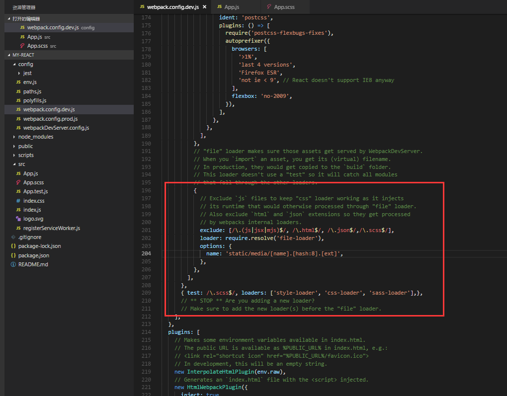

## react配置scss
刚建项目时config是默认隐藏的，需要`npm run eject`

1. webpack.config.dev.js , webpack.config.prod.js中找到exclude 添加/.scss$/

2. 在rules中添加 `{ test: /\.scss$/, loaders: ['style-loader', 'css-loader', 'sass-loader'],},`

3. dev只是在开发环境下，生产环境下需要改prod下的，内容一样



## vue 图片上传至七牛部分代码
```js
import Vue from 'vue'
export default function pushQin(f, token, cak) {
    var fp = [] // 空数组，存放批量上传后返回的url
    for(let i in f){
        let param = new FormData(); //创建form对象
        // 文件名字
        param.append('key', f[i].file.name);
        // 七牛识别的上传凭证token
        param.append('token', token);
        // 文件资源
        param.append('file', f[i].file);

        Vue.http
            .post("http://upload.qiniu.com", param, {
                emulateJSON: true,
                headers: {
                    "Content-Type": "multipart/form-data"
                }
            })
            .then(r => {
                fp.push('https://ohp96o3wl.qnssl.com/' + r.body.key)
                if(fp.length == f.length){
                    cak(fp)
                }
            })
            .catch(e => {
                console.log(e);
            });
    }
    // let param = new FormData(); //创建form对象
    // param.append('key', t[0].file.name);
    // param.append('token', this.token.qn_upToken);
    // param.append('file', t[0].file);

    // Vue.http
    //     .post("http://upload.qiniu.com", param, {
    //         emulateJSON: true,
    //         headers: {
    //             "Content-Type": "multipart/form-data"
    //         }
    //     })
    //     .then(r => {
    //         console.log('https://ohp96o3wl.qnssl.com/' + r.body.key);
    //     })
    //     .catch(e => {
    //         console.log(e);
    //     });
}
```

## 在vuex的actons里log  this，会有dispatch，打包报错

在vue里想action，this.dispatch其他文件的action，未打包之前正常，但是打包会有问题

解决办法:注入文件,直接使用state赋值，如:
```
import hhotel from './hotel-form'


hhotel.state.fileCtns = record.proofImg ? record.proofImg.split(',') : []
```


## capture为空在ios上也会直接调用相机

一般调用相机是：capture='camera' ，但是在ios上 capture=''也会调用，必须没有capture属性才可以